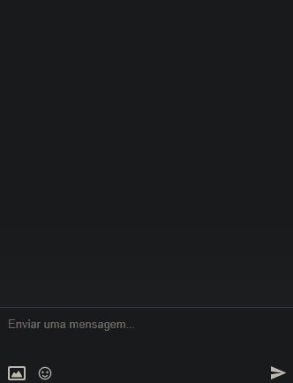
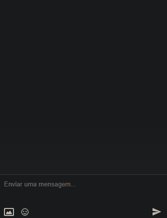
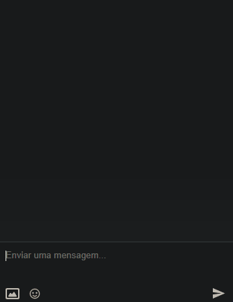
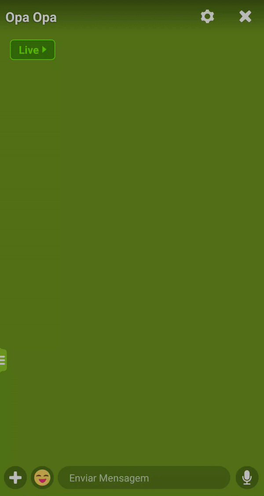
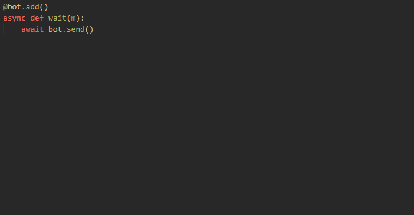
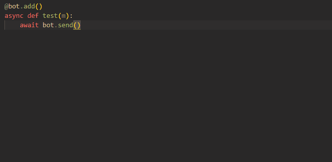
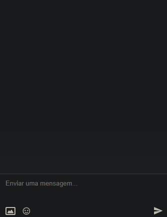
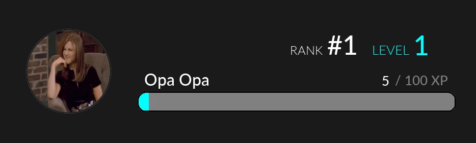

* [Examples](#examples)
    * [Minimal example](#examples)
    * [Send files](#files)
    * [Wait for messages](#wait)
    * [Send embed](#embed)
* [Recommendations](#recommendations)
* [Events](#events)
    * [ready](#event-ready)
    * [close](#event-close)
    * [message](#event-message)
    * [join_chat](#event-join-chat)
    * [leave_chat](#event-leave-chat)
    * [image](#event-image)
* [MakeImage](#makeimage)
    * [Recreating mee6 rank card](#rank-card)
* [Objects](#objects)
    * [Chat.messages](#chat.messages)
    * [Chat.clear](#chat.clear)
    * [Chat.members](#chat.members)
    * [Chat.join](#chat.join)
    * [Chat.leave](#chat.leave)
    * [File.get](#file.get)
    * [User.search](#user.search)
    * [User.ban](#user.ban)
    * [User.unban](#user.unban)
    * [My.chats](#my.chats)
    * [My.communities](#my.communities)
    * [Community.chats](#community.chats)

<br>
<br>

# Minimal example<a id=examples></a>

```py
from amsync import Bot, WsMsg


bot = Bot('email', 'password', prefix='/')

@bot.on()
async def ready():
    print('Ready')

@bot.add()
async def hi(m: WsMsg):
    await bot.send(f'Hi {m.nickname}')

bot.run()
```
\
\
**NOTE:** It is not necessary to import **`WsMsg`**, however by setting the type of the function parameter to **`WsMsg`** (as done in the **`hi`** function), it allows the IDE to display the values of the parameters, see [recommendation](#use-typing)
\
\
Imports the required classes
```py
from amsync import Bot, WsMsg
```
\
\
Enter your email and password
<br>**NOTE:** By default the prefix is `/`
```py
bot = Bot('email', 'password', prefix='/')
```
\
\
Create an event
```py
@bot.on()
```
\
\
Insert the **event type** in the **function name**
\
\
Here we create the event **[ready](#event-ready)**, which is called when the bot starts.
\
**ready** has no parameters
```py
async def ready():
```
\
\
When the bot starts it will print Ready
```py
@bot.on()
async def ready():
    print('Ready')
```
\
\
Creates a command
```py
@bot.add()
```
\
\
**NOTE:** All commands receive the class **`WsMsg`** as a parameter
\
**NOTE:** As [said](#use-typing), it is optional to set the parameter type to **`WsMsg`**, but I personally recommend
\
\
Insert the **command name** in the **function name**
```py
async def hi(m: WsMsg):
```
\
\
Sends the **nickname of the person who called the command**
```py
await bot.send(m.nickname)
```
\
\
We created the command **hi** that sends the **nickname** of the person who called the command
```py
@bot.add()
async def hi(m: WsMsg):
    await bot.send(m.nickname)
```
\
\
Start the bot
```py
bot.run()
```
<br>
<br>

# Send files<a id=files></a>

```py
from amsync import Bot, WsMsg


bot = Bot('email', 'password')

@bot.on()
async def ready():
    print('Ready')

@bot.add()
async def gif(m: WsMsg):
    img='https://cdn.pixabay.com/photo/2015/04/23/22/00/tree-736885__340.jpg'
    await bot.send(files=img)

bot.run()
```
\
\
Send a file
```py
img='https://cdn.pixabay.com/photo/2015/04/23/22/00/tree-736885__340.jpg'
    await bot.send(files=img)
```
\
\
We can also send **gifs** and **audios** (videos I haven't implemented yet). But how about sending everything together?
\
\
**NOTE:** The audios can have a maximum of 3 minutes, it is the limit of the amino
\
**NOTE:** The gif didn't appear because I used the amino web, and it doesn't show gif apparently, but the gif was sent


```py
await bot.send(files=[
    'https://cdn.pixabay.com/photo/2015/04/23/22/00/tree-736885__340.jpg',
    'https://file-examples-com.github.io/uploads/2017/11/file_example_MP3_700KB.mp3',
    'https://img.ibxk.com.br/2018/06/22/gif-22163357233543.gif'
    ])
```
\
\
To send a local file, enter the file name
```py
await bot.send(files='image.png')
```
\
To send multiple local files, put the names in a list
```py
await bot.send(files=['image.png', 'gif.gif', 'audio.mp3'])
```
<br>
<br>

# Wait for a message<a id=wait></a>

```py
from amsync import Bot, WsMsg


bot = Bot('email', 'password')

@bot.on()
async def ready():
    print('Ready')

@bot.add()
async def wait(m: WsMsg):
    def check(_m: WsMsg):
        return _m.text == 'Hi'

    await bot.send('Say Hi')
    wait_msg = await bot.wait_for(check=check)
    await bot.send(f'Hi {wait_msg.nickname}')

bot.run()
```
\
\
We check if the message text is "Hi"
```py
def check(_m: WsMsg):
    return _m.text == 'Hi'
```
\
\
**Pause the command** until the condition (check) is met
\
**`bot.wait_for`** returns **`WsMsg`** (the same **`WsMsg`** that **`check`** received)
```py
await bot.wait_for(check=check)
```
\
\
It is also possible to specify a **maximum time in seconds** (timeout) for the condition to be met
\
If the condition **is not** met in the time limit, **`bot.wait_for`** returns **`None`**
```py
await bot.wait_for(check=check, timeout=10)
```
<br>
<br>

# Send embed<a id=embed></a>

```py
from amsync import Bot, WsMsg, Embed


bot = Bot('email', 'password')

@bot.on()
async def ready():
    print('Ready')

@bot.add()
async def embed(m: WsMsg):
    embed = Embed(
        msg_text='msg_text',
        title='title',
        text='text',
        link='https://www.google.com/',
        image='https://www.nature.com/immersive/d41586-021-00095-y/assets/3TP4N718ac/2021-01-xx_jan-iom_tree-of-life_sh-1080x1440.jpeg'
    )

    await bot.send(embed=embed)

bot.run()
```
\
\
Sets embed values
```py
embed = Embed(
    msg_text='msg_text',
    title='title',
    text='text',
    link='https://www.google.com/',
    image='https://www.nature.com/immersive/d41586-021-00095-y/assets/3TP4N718ac/2021-01-xx_jan-iom_tree-of-life_sh-1080x1440.jpeg'
)
```
\
\
Send the embed
```py
await bot.send(embed=embed)
```
<br>
<br>

# Recommendations
### **Use a .env to login**
It is **safer** and avoids cases of **exposing your account by showing your code to someone**.
When using a .env you can instantiate the bot this way
```py
bot = Bot()
```
Instead
```py
bot = Bot('email', 'password')
```
Create your .env this way
```
EMAIL=YOUR_EMAIL
PASSWORD=YOUR_PASSWORD
```
<br>
<br>

<a id=use-typing></a>
### **Define the type of the parameter in the functions that receive `WsMsg` as a parameter**
It saves a lot of time, as **allows the IDE to display the values of `WsMsg`** instead of you manually viewing the file where **`WsMsg`** is.

**Wrong**



\
\
**Correct**



<br><br>
### **Make the [`message`](#event-message) event ignore the bot messages**
Otherwise it will create an infinite loop of messages
\
\
**Wrong**


```py
@bot.on()
async def message(m: WsMsg):
    await bot.send(f'Hi {m.nickname}')
```
\
\
**Correct**


```py
@bot.on()
async def message(m: WsMsg):
    if m.uid != bot.id:
        await bot.send(f'Hi {m.nickname}')
```
<br>
<br>

<a id=download></a>
### **Download any file using File.get**
It is much simpler than creating a function that downloads a file

The function returns the file bytes

```py
from amsync import Bot, File, WsMsg

...

@bot.add()
async def ico(m: WsMsg):
    icon = await File.get(m.icon)
    await bot.send(icon)
...
```
<br>
<br>

# Events
### **ready**<a id=event-ready></a>
When the bot starts

### **close**<a id=event-close></a>
When the bot closes
\
\
&nbsp;&nbsp;&nbsp;&nbsp;&nbsp;&nbsp;&nbsp;&nbsp; **Why?**

&nbsp;&nbsp;&nbsp;&nbsp;&nbsp;&nbsp;&nbsp;&nbsp; From time to time the amino closes the way the bot uses it to detect
\
&nbsp;&nbsp;&nbsp;&nbsp;&nbsp;&nbsp;&nbsp;&nbsp;&nbsp;events (websocket), to resolve this, the bot restarts

### **message**<a id=event-message></a>
When a message is sent in chat

### **join_chat**<a id=event-join-chat></a>
When a person enters the chat

### **leave_chat**<a id=event-leave-chat></a>
When a person leaves the chat

### **image**<a id=event-image></a>
When an image is sent
<br>
<br>
<br>

# **MakeImage**
Literally any potato can create an image
<br>
<br>
<br>

<a id=rank-card></a>
## **Recreating mee6 rank card**
<br>


```py
from amsync import Bot, MakeImage, Color, WsMsg, File, ProgressBar


bot = Bot()

@bot.on()
async def ready():
    print('Ready')


@bot.add()
async def rank(m: WsMsg):
    im = MakeImage.new((934, 282), Color.PRETTY_BLACK)
    ico = await File.get(m.icon)

    icon = MakeImage(ico)
    if MakeImage.type(ico) == 'gif':
        icon = icon.to_img()

    icon.resize((165, 165))
    icon.circular_thumbnail()
    icon.add_border(2, Color.BLACK)

    pg = ProgressBar((620, 35), 15, color=Color.CYAN, bg_color=Color.GRAY)
    pg.fill(10)
    pg.add_border(2, Color.BLACK)

    im.text('RANK', 'center', (135, -45), ('lato-light.ttf', 24))
    im.text('#1', 'center', (205, -59), ('lato-medium.ttf', 52))

    im.text('LEVEL', 'center', (300, -46), ('lato-light.ttf', 26), Color.CYAN)
    im.text('1', 'center', (360, -59), ('lato-medium.ttf', 54), Color.CYAN)

    im.text(m.nickname, 'center', (-120, 15), ('lato-medium.ttf', 32))

    im.text('5', 'right', (-170, 15), ('lato-medium.ttf', 26))
    im.text('/ 100 XP', 'right', (-55, 15), ('lato-medium.ttf', 26), Color.GRAY)
    
    im.paste(icon, 'left', (50, 0))
    im.paste(pg, 'center', (115, 60))
    await bot.send(files=im.bytes)

bot.run()
```
## Download the fonts **[here](https://www.1001fonts.com/lato-font.html)**

I don't know if it's exactly the same source as mee6, but it's similar

### Use **only** truetype fonts (.ttf)
<br>
<br>
<br>

We create the background of the image
* It will be **934 x 282** (size that mee6 uses)
* And the background color will be **`Color.PRETTY_BLACK`** (26, 26, 26)
```py
im = MakeImage.new((934, 282), Color.PRETTY_BLACK)
```

<br>
<br>
<br>

We downloaded the icon of the user who sent the command
```py
ico = await File.get(m.icon)
```
<br>
<br>
<br>

We transformed this icon into an image to edit
```py
icon = MakeImage(ico)
```

<br>
<br>
<br>

However, the icon can be a gif, so we use **`MakeImage.type`** that identifies the file type
\
\
If it's a gif, we transform it into an image
```py
if MakeImage.type(ico) == 'gif':
    icon = icon.to_img()
```
<br>
<br>
<br>

**NOTE:** To create a circular icon you need to make it equal in height and width

To make the icon round, first we need to make it square **165 x 165**
```py
icon.resize((165, 165))
```

<br>
<br>
<br>

We rounded
```py
icon.circular_thumbnail()
```

<br>
<br>
<br>

We added a **4px** border with **black color**
```py
icon.add_border(4, Color.BLACK)
```

<br>
<br>
<br>

We created the progress bar, with
* **620 x 35**
* **15px radius**
* Background color, **gray**
* Fill color, **cyan**
```py
pg = ProgressBar((620, 35), 15, color=Color.CYAN, bg_color=Color.GRAY)
```

<br>
<br>
<br>
<br>

**NOTE:** Do not use too large a radius, otherwise the progress bar will look like this
```py
 pg = ProgressBar((620, 35), 30, color=Color.CYAN, bg_color=Color.GRAY)
```

<br>
<br>
<br>
<br>

Let's fill **10px** of the progress bar with the fill color, cyan
```py
pg.fill(10)
```

<br>
<br>
<br>
<br>

Add a **2px** border with **black color**
```py
pg.add_border(2, Color.BLACK)
```

<br>
<br>
<br>
<br>

We added a text with:
* Content **RANK**
* Positioned in the **center** of the background image
* Moving **135px to right** and **45px to top**
* With the font **lato-light.ttf** of size **24px**
* By default the text color is **Color.WHITE**
```py
im.text('RANK', 'center', (135, -45), ('lato-light.ttf', 24))
```

<br>
<br>
<br>

The same thing said above applies here, but here the text color is **cyan**
```py
im.text('LEVEL', 'center', (300, -46), ('lato-light.ttf', 26), Color.CYAN)
```

<br>
<br>
<br>
<br>

Here the text will be the **name of the user** who sent the message
```py
im.text(m.nickname, 'center', (-120, 15), ('lato-medium.ttf', 32))
```

<br>
<br>
<br>
<br>

To add the icon and the progress bar, we need to paste them into the background image
\
For this we use the function **`paste`** that pastes the images
* We paste the icon to the **left of the background image**
* We moved **50px to right**
```py
im.paste(icon, 'left', (50, 0))
```

<br>
<br>
<br>
<br>

* We paste the progress bar in the **center of the background image**
* We moved **115px to right** and **65px to bottom**
```py
im.paste(pg, 'center', (115, 60))
```

<br>
<br>
<br>
<br>

We send the created image
\
\
**NOTE:** Do not forget the **.bytes**, as we need to send the image bytes
```py
await bot.send(files=im.bytes)
```
<br>
<br>
<br>
<br>

# **Objects**
<br>

## **Chat.messages**
Get chat messages
```py
from amsync import Bot, Chat


bot = Bot()

@bot.add()
async def test(m: WsMsg):
    def check(_m: WsMsg):
        return _m.type == 100

    await Chat.messages(check=check)

bot.run()
```
**NOTE:** If the bot **takes too long to show the messages** it is because the way the amino uses it to get the chat messages **is by token** and **not by index**, that is, **in a chat with 10k messages the bot can only get every 100 messages**, and not all at once.
\
So a basic calculation, remembering that **it takes ~0.2s to get 100 messages**
\
(10_000 / 100) * 0.2 = 20s
\
\
**The bot takes ~ 20s to get 10k of messages**
\
\
\
As in **[Bot.wait_for](#wait)** we can use a function to get a message that meets a condition.
\
Checks if the message has a type of 100
```py
def check(_m: WsMsg):
    return _m.type == 100
```
\
\
Get the messages
```py
await chat.messages(check=check)
```
\
\
By default **`Chat.messages`** gets all chat messages.
\
To get the **first 100 chat messages** for example, set the **`start`** and **`end`**
```py
await chat.messages(check=check, start=0, end=100)
```
**NOTE: `start`** and **`end`** work like a python list, **0** is the **most recent message**, **-1** is the **most old**
<br>
<br>
<br>

## **Chat.clear**
Clears chat messages
```py
from amsync import Bot, Chat


bot = Bot()

@bot.add()
async def test(m: WsMsg):
    def check(_m: WsMsg):
        return _m.type == 100

    await Chat.clear(check=check)

bot.run()
```

Everything that was said in **[Chat.messages](#Chat.messages)** applies in **`Chat.clear`**
\
\
**NOTE:** It may take a while to get the messages, but **to delete it is quick.**
\
**NOTE:** The amino does not handle very well when many messages are deleted at the same time, so always reload the chat to check if the messages have been deleted or leave the chat screen and enter again
\
\
You can also enter the **message id** directly
```py
await Chat.clear('message id')
```
Or several **messages ids**
```py
await Chat.clear(['message id', 'message id', 'message id'])
```
<br>
<br>
<br>

## **Chat.members**
Get chat members
```py
from amsync import Bot, Chat, User


bot = Bot()

@bot.add()
async def test(m: WsMsg):
    def check(_m: User):
        return _m.level > 8

    await Chat.members(check=check)

bot.run()
```
Everything that was said in **[Chat.messages](#Chat.messages)** applies in **`Chat.members`**.
\
But **`check`** receives **`User`** instead of **`WsMsg`** and **it doesn’t take long to get users**
<br>
<br>
<br>

## **Chat.join**
Enter a chat
```py
from amsync import Bot, Chat


bot = Bot()

@bot.add()
async def test(m: WsMsg):
    await Chat.join('chat_id')

bot.run()
```
\
\
You can join multiple chats
```py
await Chat.join(['chat_id', 'chat_id', 'chat_id'])
```
\
\
And specify the community
\
**NOTE:** By default, **com_id** is the community where the message was sent
```py
await Chat.join('chat_id', 'com_id')
```
<br>
<br>
<br>

## **Chat.leave**
Leave a chat
```py
from amsync import Bot, Chat


bot = Bot()

@bot.add()
async def test(m: WsMsg):
    await Chat.leave('chat_id')

bot.run()
```
Everything said in [Chat.join](#Chat.join) applies here
<br>
<br>
<br>

## **File.get**
[Recomendation](#download)
<br>
<br>
<br>

## **User.search**
On some occasions, the amino does not show all information about the user, so we can use this function to obtain the user's information
```py
from amsync import Bot, WsMsg, User


bot = Bot()

@bot.on()
async def ready():
    print('Ready')

@bot.add()
async def level(m: WsMsg):
    level = (await User.search(m.uid)).level
    await bot.send(f'Level: {level}')

bot.run()
```
\
\
**NOTE:** You **need** put parentheses around **`await user.search(m.uid)`**, otherwise it will give an error
\
\
Obtain the user level
```py
level = (await User.search(m.uid)).level
```
\
\
And we send
```py
await bot.send(f'Level: {level}')
```
\
\
We can also insert multiple uids
```py
await User.search(['uid', 'uid', 'uid'])
```
<br>
<br>
<br>

## **User.ban**
Ban a person
```py
@bot.add()
async def ban(m: WsMsg):
    if m.mentioned_users:
        uid = m.mentioned_users[0]
        nickname = (await user.search(uid)).nickname

        await User.ban(uid)
        await bot.send(f'{nickname} banned')
```
\
\
Checks if a user has been mentioned
```py
if m.mentioned_users:
```
\
\
\
**NOTE: `WsMsg.mentioned_users`** returns a list containing the uids of the mentioned users

Get nickname
```py
uid = m.mentioned_users[0]
nickname = (await User.search(uid)).nickname
```
\
\
Ban the user
```py
await User.ban(uid)
await bot.send(f'{nickname} banned')
```
<br>
<br>
<br>

## **User.unban**
```py
@bot.add()
async def unban(m: WsMsg):
    if m.mentioned_users:
        uid = m.mentioned_users[0]
        nickname = (await User.search(uid)).nickname

        await User.unban(uid)
        await bot.send(f'{nickname} desbanido')
```
Everything said in **[User.ban](#user.ban)** applies here
<br>
<br>
<br>

## **My.chats**
Shows all chats that you are from all communities

```py
from amsync import Bot, My

bot = Bot()

@bot.on()
async def ready():
    await My.chats(need_print=True, ignore_ascii=True)

bot.run()
```
<br>
<br>

**`need_print=True`** print beautifully
```
◌᮫۪۪ ⊹Orfanato Little Sunshine's✦ ◦۪˚ -> 4b2cfe86-f16b-45fd-a3fa-7578a60d034f
𝒥𝒶𝓃𝓉𝒶𝓇 𝒹ℯ 𝒩𝒶𝓉𝒶𝓁 🎅 🎄🍗                  -> 8ab4a197-892e-4cd3-a84b-77631f3776cb
(˳░ # mansão. ░۪ᤲ)                    -> 20b36d1b-853e-4dcb-b656-032d30dc960e
𝒥𝒶𝓃𝓉𝒶𝓇 𝒹ℯ 𝒩𝒶𝓉𝒶𝓁 🎅 🎄🍗                  -> 799ac83b-66a5-48f6-98ec-64a7b40d4399
𓍯 Divulgação 🌐𓂅                       -> a4573947-372c-478d-8c3d-65b9b2426150
.....Xndjsh                           -> 9815bbe8-cece-438d-883f-14fc04b13620
𓂃 曉 ִֶָLost Park 🍃ⸯ                   -> 7500b838-e50c-4a07-8d9c-a72eef145d06
🍦 ✕ Praia Clube︕                      -> bfb23db2-c75b-4955-8d3a-e319b02ebf56
```
<br>
<br>
<br>

**`ignore-ascii=True`** align the ids
```
Orfanato Little Sunshine's -> 4b2cfe86-f16b-45fd-a3fa-7578a60d034f
Jantar de Natal            -> 8ab4a197-892e-4cd3-a84b-77631f3776cb
( # mansao. )              -> 20b36d1b-853e-4dcb-b656-032d30dc960e
Jantar de Natal            -> 799ac83b-66a5-48f6-98ec-64a7b40d4399
Divulgacao                 -> a4573947-372c-478d-8c3d-65b9b2426150
.....Xndjsh                -> 9815bbe8-cece-438d-883f-14fc04b13620
Lost Park                  -> 7500b838-e50c-4a07-8d9c-a72eef145d06
Praia Clube!               -> bfb23db2-c75b-4955-8d3a-e319b02ebf56
```
<br>
<br>

## **My.communities**
Show your communities

```py
from amsync import Bot, My

bot = Bot()

@bot.on()
async def ready():
    await My.communities(need_print=True, ignore_ascii=True)

bot.run()
```
Everything said in [My.chats](#My.chats) applies here
<br>
<br>
<br>

## **Community.chats**
Shows all public chats in a community
```py
from amsync import Bot, WsMsg, Community

bot = Bot()

@bot.on()
async def ready():
    print('Ready')

@bot.on()
async def message(m: WsMsg):
    await Community.chats(need_print=True, ignore_ascii=True)

bot.run()
```
Everything said in [My.chats](#My.chats) applies here
